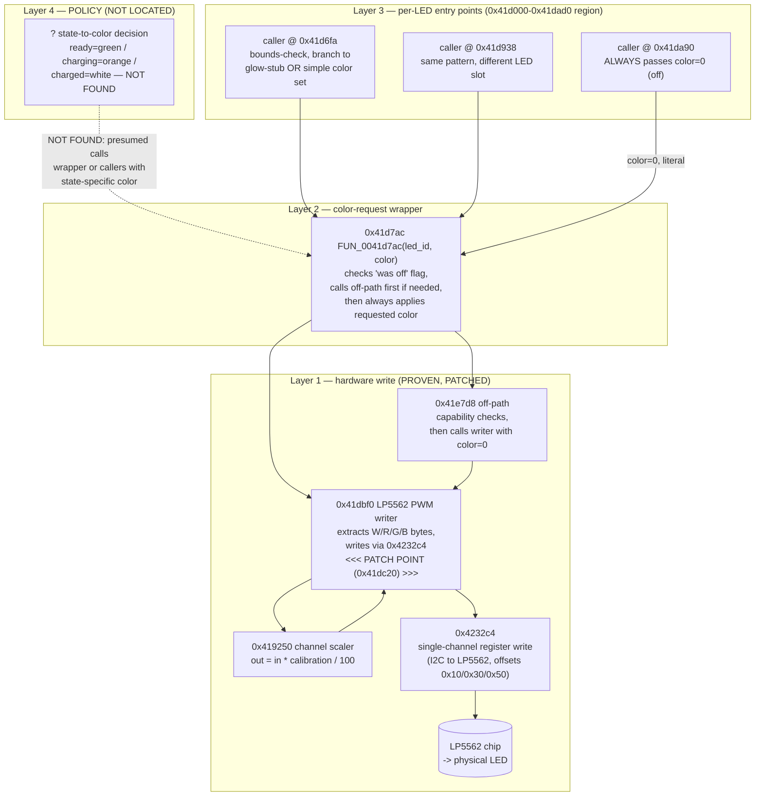

# 07 — LED Subsystem Architecture

## Overview

The LED subsystem is organized in layers, consistent with the multiple
source filenames found in the firmware (`led.c`, `led_driver_lp5562.c`,
`led_driver_gpio.c`, `led_policy_knuckles.c`). This document describes what
was traced, layer by layer, from the physical hardware write upward, and is
explicit about where the trace currently stops.

**Confidence note:** everything from the low-level PWM writer up through the
color-request wrapper (layers 1–3 below) is verified with 100% confidence —
both by static analysis (clean Ghidra decompilation, exhaustive caller
search) and by live behavioral proof (the layer-1 patch in
`docs/15_firmware_patching.md` visibly changed the physical LED). Layer 4
and above (policy / state decision) is **not** verified and is the subject
of `docs/16_charging_led_research.md`.

## Layered call graph (traced layers)

## Layer-by-layer description

### Layer 1 — hardware write (`0x41dbf0`, `0x419250`, `0x4232c4`)

The lowest level. `0x41dbf0` receives a caller-supplied `(led_id, packed_wrgb_color)`
pair, calls `0x419250` to apply a per-channel calibration scale (see
`docs/06_firmware_symbols.md` §6.3 for the exact arithmetic), then writes
each resulting byte to the LP5562 via `0x4232c4`.

This is the layer where the project's proven patch lives: at runtime address
`0x41dc20`, inside `0x41dbf0`, the instruction `mov r4, r0` (which copies the
freshly-scaled color into the register used for all three channel writes)
was replaced with `movs r4, #0`, forcing every color request — from every
caller, regardless of what color was actually requested — to be written as
black. Full patch mechanics in `docs/15_firmware_patching.md`; live
visual proof in `docs/13_experiments.md` Experiment 7.

**Why this proves every state flows through here:** the patch is
unconditional and was observed to turn off the LED regardless of device
state (the controller was in a "charge terminated" / fully-charged state at
the time of one test, and off in another). This means Layer 1 is a true
choke point — every color, from every policy state, passes through this
exact function. That is what makes an "always off" patch trivial and
reliable, and also exactly why a *selective* patch cannot be made at this
layer alone (see `docs/16_charging_led_research.md`).

### Layer 2 — color-request wrapper (`0x41d7ac`)

A thin layer that adds one behavior: if a per-LED "was previously off" flag
is set, it clears that flag and first calls the off-path function
(presumably to ensure a clean transition), then unconditionally calls the
Layer 1 writer with whatever color the caller requested. This function
decompiled cleanly with Ghidra and its logic is fully understood — see the
decompiled source excerpt in `research/decompiler_notes/wrapper_decompile.c`.

### Layer 3 — per-LED entry points (unbounded code region)

Three direct callers of the Layer 2 wrapper were found via Ghidra's
reference manager (after correcting the entry-point address mistake
described in `docs/06_firmware_symbols.md` §6.3):

- `0x41d6fa` and `0x41d938` follow the same pattern: bounds-check the LED
  ID, then check a per-LED struct field; if set, branch to a different
  function entirely (believed to be "glow"/pattern-related — see
  `0x41dac4`/`0x41dccc`, not further traced); otherwise, read a color value
  from a struct field and call the Layer 2 wrapper with it.
- `0x41da90` is simpler: bounds-check, then **always** call the wrapper with
  a literal `color = 0`.

None of these three functions themselves contain a literal color constant
for anything resembling "green" or "orange" — the color is always read from
a struct field passed in by *their* caller, which was not located (this is
exactly the Layer 3 → Layer 4 gap described below).

**Important caveat on Layer 3 completeness:** Ghidra's own function-start
heuristics did not recognize any of these three functions, or several
related helper functions nearby (a "glow not supported" stub, an
ownership-tag-based table-iteration function, a struct-clearing "always off"
utility), as being reachable by any statically-discoverable call path.
Manual disassembly located and read through this entire ~620-byte code
region successfully (see `research/decompiler_notes/gap_region_listing.txt`
for the full linear listing), but **no caller of any of these Layer 3
functions was ever found** — not via Ghidra's reference manager, not via an
exhaustive brute-force scan for every possible direct `BL` instruction
encoding targeting them, and not via a raw-pointer search for their
addresses stored as data anywhere in the image. This is a genuine, currently
unresolved mystery, discussed further in `docs/09_led_policy.md` and
`docs/14_failed_attempts.md`.

### Layer 4 — policy (not located)

The actual decision "when the controller is charging, use orange; when
fully charged, use white; otherwise (ready/in-use), use green" was not
traced to specific code. What *is* known: the power-management (`PM`) task's
charging-state-transition code (located via its own log strings, e.g.
`" PM -> charging\n"`) does **not** directly call any function in the LED
call graph above — it calls a different, unrelated set of functions,
strongly suggesting an RTOS shared-state or message-queue connection rather
than a direct function call between the power-management task and whatever
task actually applies the LED color (believed to be the `vrc` task, per the
live `tasks` debug shell command listing, though this is not confirmed).
Full account in `docs/16_charging_led_research.md`.

## Parallel path: GPIO driver

`0x41d764` and `0x41d6b4` implement a structurally similar but separate code
path using `led_driver_gpio.c`, presumably for hardware that uses discrete
GPIO-driven LEDs instead of (or in addition to) the LP5562. This path was
identified but not extensively traced, since the primary status LED under
test is confirmed LP5562-driven (`docs/03_hardware.md`,
`docs/08_lp5562_driver.md`). `0x41d804` appears to be a hardware-type
dispatcher choosing between the two paths based on a per-LED configuration
byte, though this was only traced one call deep (`docs/06_firmware_symbols.md`
§6.3).

## Diagrams referenced elsewhere

- Firmware patch application workflow: `docs/15_firmware_patching.md`.
- Protocol-level flow (SteamVR → HID → firmware): `docs/10_protocol_analysis.md`.
